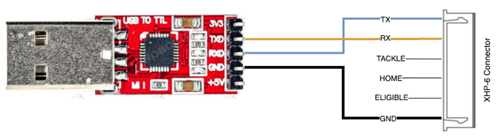

# tackle-sensor-utility

## Power and Connect Hardware

Connect your tackle sensor hardware to your PC or Mac using a UART to USB serial dongle.  Ensure the proper drivers for the dongle are installed on your computer.  Power your tackle sensor normally.

## Launch the Utility

Use a Chromium based web browser and visit https://collegiate-robotic-football-conference.github.io/tackle-sensor-utility/ to use the utility.